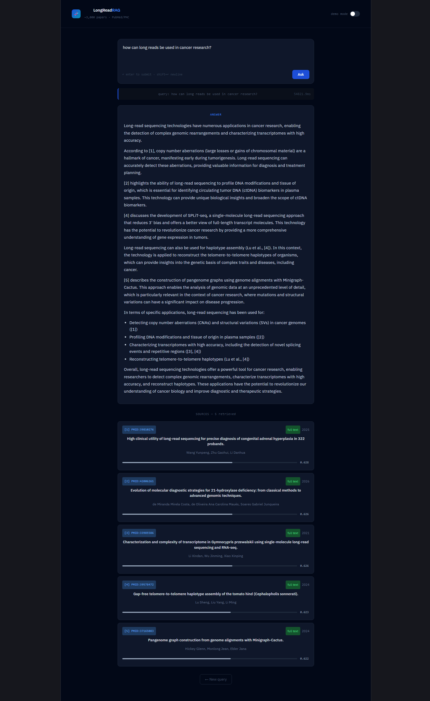

# Long-Read Sequencing Literature RAG

A Retrieval-Augmented Generation system for querying the long-read sequencing scientific literature.
Fetches papers from PubMed, PMC, and Europe PMC, builds a ChromaDB vector index, and answers natural
language questions grounded in the literature with source citations.



## Architecture

```
PubMed / PMC / Europe PMC
         │
         ▼
src/fetch.py        ← fetch abstracts + full text via Entrez & Europe PMC APIs
         │
         ▼  data/raw/papers.json
src/index.py        ← chunk → embed (BAAI/bge-small-en-v1.5) → ChromaDB collection
         │           ← MLflow tracks embedding model, chunk size, corpus stats
         ▼  data/chromadb/
src/rag.py          ← retrieve top-k chunks → build prompt → LLM answer
         │
         ▼
app/main.py         ← FastAPI: POST /ask  GET /health  GET /stats
         │           ← MLflow tracks every query + latency
         ▼
frontend/           ← React/Vite UI (dark theme, demo mode, animated sources)
```

## Quickstart

```bash
# 1. Install
pip install -r requirements.txt

# 2. Set your email for NCBI (required by their API policy)
export ENTREZ_EMAIL="your@email.com"

# 3. Set your LLM API key (skip if using Ollama)
export ANTHROPIC_API_KEY="sk-..."   # or OPENAI_API_KEY

# 4. Fetch papers (~3000 abstracts, +full text where available)
python -m src.fetch --fetch_full

# Optionally include Europe PMC papers (adds ~1000 more)
python -m src.fetch --fetch_full --include_europe_pmc

# 5. Build the ChromaDB index (tracked in MLflow)
python -m src.index

# Re-index from scratch (drops and recreates the collection)
python -m src.index --reset

# 6. Try a query from the CLI
python -m src.rag --query "What are the main error modes of Oxford Nanopore sequencing?"

# 7. Start the API
uvicorn app.main:app --reload

# 8. Start the frontend (separate terminal)
npm create vite@latest frontend -- --template react
# Replace the App.jsx from frontend/src
# then start the frontend
cd frontend && npm install && npm run dev
# Open http://localhost:5173

# 9. View MLflow experiments
mlflow ui
# Open http://localhost:5000
```

## LLM backends

The RAG pipeline supports three backends, selected via `--llm`:

| Backend          | Flag              | Requirement                                                     |
| ---------------- | ----------------- | --------------------------------------------------------------- |
| Ollama (default) | `--llm ollama`    | `ollama pull llama3.1:8b`                                       |
| Anthropic Claude | `--llm anthropic` | `ANTHROPIC_API_KEY` + uncomment `anthropic` in requirements.txt |
| OpenAI           | `--llm openai`    | `OPENAI_API_KEY` + uncomment `openai` in requirements.txt       |

```bash
# Use Ollama (local, free)
ollama pull llama3.1:8b
python -m src.rag --query "..." --llm ollama

# Use Claude
python -m src.rag --query "..." --llm anthropic

# Use OpenAI
python -m src.rag --query "..." --llm openai
```

## Example API usage

```bash
curl -X POST http://localhost:8000/ask \
  -H "Content-Type: application/json" \
  -d '{"query": "How does PacBio HiFi compare to Nanopore for structural variant detection?", "top_k": 5}'
```

Response:
```json
{
  "query": "How does PacBio HiFi compare to Nanopore...",
  "answer": "Based on the literature, PacBio HiFi shows higher base accuracy (~99.9%) [1][2] while Nanopore offers...",
  "latency_ms": 1240.3,
  "sources": [
    {
      "pmid": "38291847",
      "title": "Benchmarking long-read sequencing for structural variant detection",
      "year": "2024",
      "authors": "Li H, Feng X, Chu C",
      "score": 0.8821,
      "has_full": true
    }
  ]
}
```

## Frontend

A React/Vite single-page app at `frontend/` connects to the FastAPI backend.

- Dark theme, keyboard-first (Enter to submit)
- Demo mode — toggle in the header to preview with mock data (no API required)
- Animated source cards with cosine similarity score bars
- Example query buttons for quick exploration

```bash
cd frontend
npm install
npm run dev   # http://localhost:5173
```

## Docker

```bash
docker build -t longread-rag .

# Mount your data directory so the index persists
docker run -p 8000:8000 \
  --network host \
  -v $(pwd)/data:/app/data \
  -e OLLAMA_HOST=http://172.17.0.1:11434 \
  longread-rag
```

## Experiment tracking

Every indexing run and every query is logged to MLflow:

| Run type | Logged params                       | Logged metrics                                              |
| -------- | ----------------------------------- | ----------------------------------------------------------- |
| Indexing | model, chunk_size, overlap, backend | n_papers, n_full_text, n_chunks, new_chunks, total_in_index |
| Query    | query text, top_k                   | latency_ms, n_sources                                       |

```bash
mlflow ui   # http://localhost:5000
```

## Corpus sources

| Source          | Coverage                    | Flag                   |
| --------------- | --------------------------- | ---------------------- |
| PubMed (Entrez) | ~3,000 abstracts            | default                |
| PubMed Central  | full text where open-access | `--fetch_full`         |
| Europe PMC      | ~1,000 additional papers    | `--include_europe_pmc` |

## Project structure

```
longread_rag/
├── src/
│   ├── fetch.py        # PubMed/PMC/Europe PMC data collection
│   ├── index.py        # Chunking, embedding, ChromaDB
│   └── rag.py          # Retrieval + generation pipeline
├── app/
│   └── main.py         # FastAPI endpoints
├── frontend/
│   └── src/App.jsx     # React/Vite UI
├── data/
│   ├── raw/            # papers.json (gitignored)
│   └── chromadb/       # ChromaDB collection (gitignored)
├── Dockerfile
├── requirements.txt
└── README.md
```

## Author

Paolo Inglese
